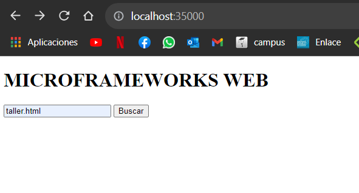

# TALLER MICROFRAMEWORKS WEB - Camilo Cantillo T
## En este taller usted debe explorar la arquitectura del microframework WEB denominado sparkweb (https://sparkjava.com/). Este micro framework permite construir aplicaciones web de manera simple usando funciones lambda.

### Inicialización:
Estas instrucciones te ayudarán a obtener una copia del proyecto en funcionamiento en tu máquina local para desarrollo y pruebas. Consulta la sección de "Despliegue" para obtener notas sobre cómo implementar el proyecto en un sistema en vivo.

### Prerequisitos:
Cosas que necesitas instalar y cómo hacerlo.

- Java Development Kit (JDK)
- Maven
- Git

### Instalando el proyecto:

1. Para tener una copia en local del repositorio debemos abrir la termial y estar ubicado en la carpeta que queremos clonar el repositorio, seguido a esto utilizamos el comando:

```
https://github.com/CamiloCanta/AREP_lab3
```

2. Preferencialmente, solemos abrir el proyecto en una IDE, por lo cual abriremos el proyecto en esta misma, abriremos la terminal y ejecutamos el codigo:
```
mvn package
mvn exec:java
o
mvn exec:java -"Dexec.mainClass"="escuelaing.arep.HttpServer
```
3. Ya ejecutada la aplicación, procedemos a abrir el navegador de nuestra preferencia y usamos la siguiente URL:

```
http://localhost:35000
```
4. Una vez en la página podemos realizar busquedas de los archivos(importante darle el botón buscar y no presionar enter):

   



5. Así se verá cuando se realice una consulta:

   


### Correr los tests
En nuestra IDE usamos el siguiente codigo para correr las pruebas unitarias:
```
mvn test
```

### Documentación:
Con el siguiente comando veremos la documentación:
```
mvn javadoc:javadoc
```

### Contrucción:
- Java
- Maven
- Git

### Autor:
Camilo Andres Cantillo Tatis

